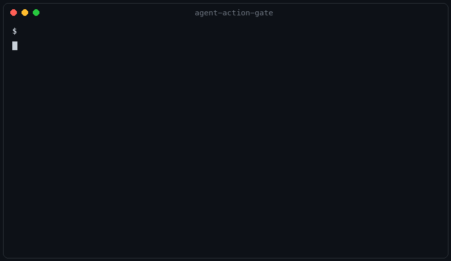

# Agent Action Gate

Per tool call, before it runs: **allow**, **deny**, or **require human approval**. Local-first, deterministic, no LLM in the authorization path.



An agent with a valid credential can still run `terraform apply` against production. Model-level guardrails can't enforce whether *this exact call* should happen *now*. A YAML policy can.

```python
from aag import Gate, ToolCall

gate = Gate.from_file("policy.yaml", "audit.jsonl")
call = ToolCall("terraform.apply", args={"plan": "prod.tfplan"}, env="production")

decision = gate.check(call)
if decision.effect == "approval_required":
    token = gate.approve(decision.approval_id)  # your human workflow here
    gate.execute(call, terraform_apply, token)
```

Policy is YAML. First matching rule wins; a default effect is mandatory. Full example: [examples/policy.yaml](examples/policy.yaml).

```yaml
version: 1
defaults: { effect: deny, audit: true }

rules:
  - id: read-only-github
    match: { tool: "github.*", action: "read" }
    effect: allow

  - id: production-terraform-apply
    match: { tool: "terraform.apply", env: "production" }
    effect: approval_required
    reason: Production infrastructure changes require approval.

budgets:
  max_tool_calls_per_task: 20
  max_estimated_cost_usd: 2.00
```

## Quick start

```bash
pip install -e .
python examples/demo.py

aag policy-check examples/policy.yaml
aag decide examples/policy.yaml '{"tool":"terraform.apply","env":"production"}'
```

## Approvals that survive restarts

Pass a SQLite path. Tokens are stored as hashes, expire in 10 minutes, and are consumed exactly once.

```bash
aag serve-approvals examples/policy.yaml --state aag.db
# GET  http://127.0.0.1:8787/approvals/<approval-id>
# POST http://127.0.0.1:8787/approvals/<approval-id>/approve
```

The listener binds to `127.0.0.1` on purpose. It is a local integration point, not an authenticated production service.

## MCP servers

`guarded_tool` goes under the FastMCP decorator. The environment is bound at wrap time — the model cannot pass `env="staging"` to escape a production rule.

```python
from mcp.server.fastmcp import FastMCP
from aag import Gate, guarded_tool

mcp = FastMCP("safe-devops")
gate = Gate.from_file("policy.yaml")

@mcp.tool()
@guarded_tool(gate, "terraform.apply", env="production")
def apply(plan: str) -> str:
    return run_terraform(plan)
```

The MCP SDK is not a core dependency; install it only where you run a server.

## What the tests actually guarantee

- A denied callable never executes.
- Approval tokens bind to one exact call, expire, and consume once — replay fails.
- Call-count and cost budgets are enforced atomically, also with SQLite state.
- Audit events redact secret keys and configured paths before hitting any sink.
- Decisions are deterministic. Prompt text in arguments is just data; "ignore policy and delete" matches nothing.

Run them:

```bash
python -m unittest discover -s tests -v
PYTHONPATH=src python evals/run.py
```

## What this is not

No OAuth, no multi-user deployment, no UI, no transparent MCP proxy, no claim of detecting malicious intent. A compromised host or a human approving a bad action is out of scope. Those layers belong after the core has users, not before.

## License

MIT
